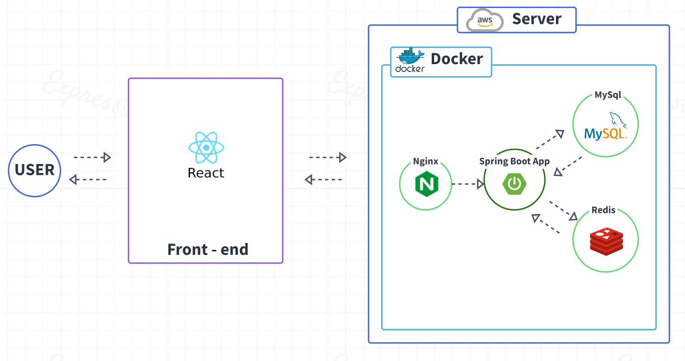
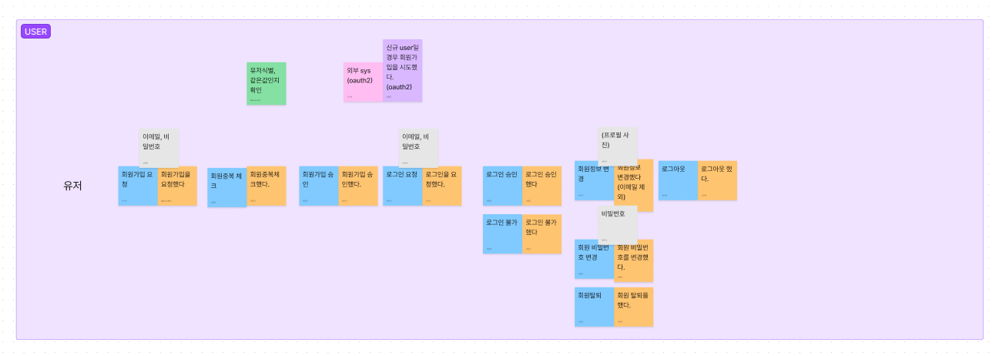
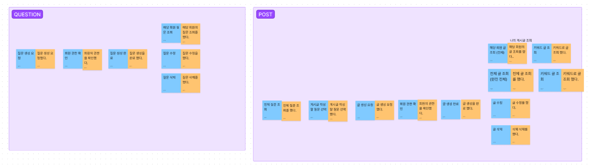

# IamMomo

## 1. Momo 란

- 본격 '일상 공감' 프로젝트입니다.
- 모든 글은 '모모'라는 닉네임을 사용하며 가벼운 일상에서 부터 진솔한 감정까지 다양한 이야기로 서로의 삶을 공유하는 서비스입니다.
- 베타 버전 출시를 위해 현재 기획 및 개발 진행중입니다.

> **Project Duration** : 2022.04.16 ~ 2021.04.27

> **Server renewal Duration** : 2022.06 ~ 진행중

## 2. 구성

> **Project Duration** : 2022.06 ~ 진행중

## 3. 서버

- Elastic Beanstalk을 사용하여 AWS에 애플리케이션 배포
- Docker running on 64bit Amazon Linux 2/3.5.2
- Mysql, Redis 를 사용하여 데이터 관리
- Spring boot, Mysql, Nginx, Redis, Docker를 사용한 웹 서버
- Github Actions를 사용한 CI CD 구축

## 4. 설계
- 이벤트 스토밍을 통한 설계 진행(추후 수정 예정)

## 5. Roadmap
- OAUTH2, JWT를 사용하여 로그인, 로그아웃, 회원가입 기능 구현
- Mysql을 통한 회원 정보 관리
- Redis를 통한 JWT Token 관리
- Docker를 사용한 애플리케이션 배포
- Github Actions를 사용한 CI CD 구축

| Databeses                  | Tables                         |
| -------------------------- | ------------------------------ |
|  |  |

| Login (redis에 token)      | Logout (redis에 logout된token)|
| -------------------------- | ----------------------------- |
|  |  |

